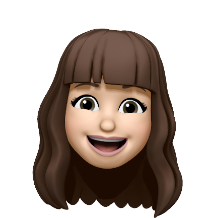

### Hi there and Welcome to my GitHub 👋

# ✨ I'm Emilie, a Front-end | React Developer ✨

I worked for over 10 years as a salesperson and team manager. I really appreciated it but it wasn't a vocation, just a nice job.  
Two years ago, I started a professional reconversion.

### Why the developer job ?

**In fact, it was the job that found me!**

During my training as a project manager / design specialist, I had to complete an introductory course in HTML/CSS and 😵 ... I fell in love with coding and decided to change my training path to become a front-end developer. 😍

### Did I regret it ?

**Not for a single day!**

This job is passionate and offers many possibilities!  
I've always been curious and a constant learner, and you could say that with this job, my thirst for knowledge and continuous improvement is fulfilled!

**A lot of challenges, interacting with very interesting people and what a pleasure it is to rack my brains to solve problems !**

    <h2>Languages & Tools</h2>
    &nbsp;
    &nbsp;
    &nbsp;
    &nbsp;
    

<!--
** a ✨ _special_ ✨ repository because its `README.md` (this file) appears on your GitHub profile.

Here are some ideas to get you started:

- 🔭 I’m currently working on ...
- 🌱 I’m currently learning ...
- 👯 I’m looking to collaborate on ...
- 🤔 I’m looking for help with ...
- 💬 Ask me about ...
- 📫 How to reach me: ...
- 😄 Pronouns: ...
- ⚡ Fun fact: ...
-->
